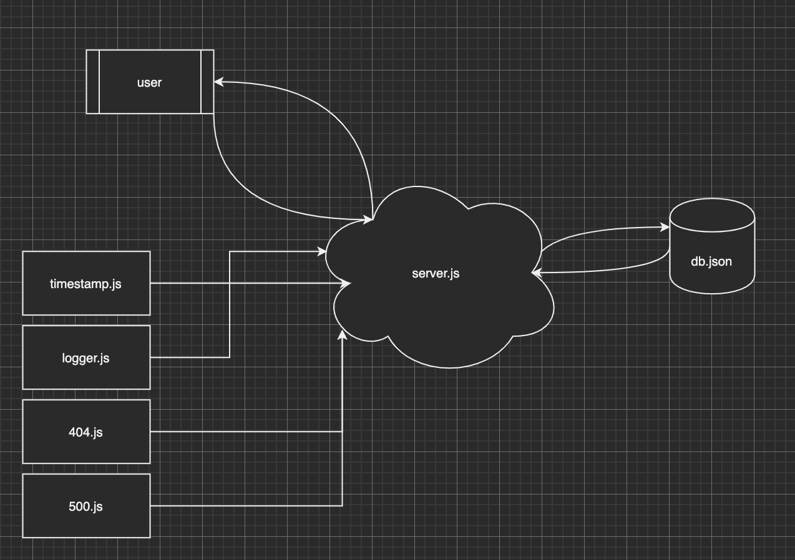

# LAB - Class 8
## Lab 8 - Express & COnnected API
### Author: Clayton Jones

### Links and Resources  

[submission PR](https://github.com/claytonjones-401n16/lab-07/pull/2)
[GitHub Actions](https://github.com/claytonjones-401n16/lab-07/actions)
[back-end URL](https://js-401-lab-07.herokuapp.com/)

### Setup  

#### .env requirements 

- `PORT`
- `MONGODB_URI`
  
#### How to initialize/run your application (where applicable)
`node index.js` OR
`nodemon`

#### Documentation   
To view API docs:
- use URL `https://js-401-lab-07.herokuapp.com/api-docs`
  
#### Tests  

How do you run tests?
- `npm test`

#### UML  

